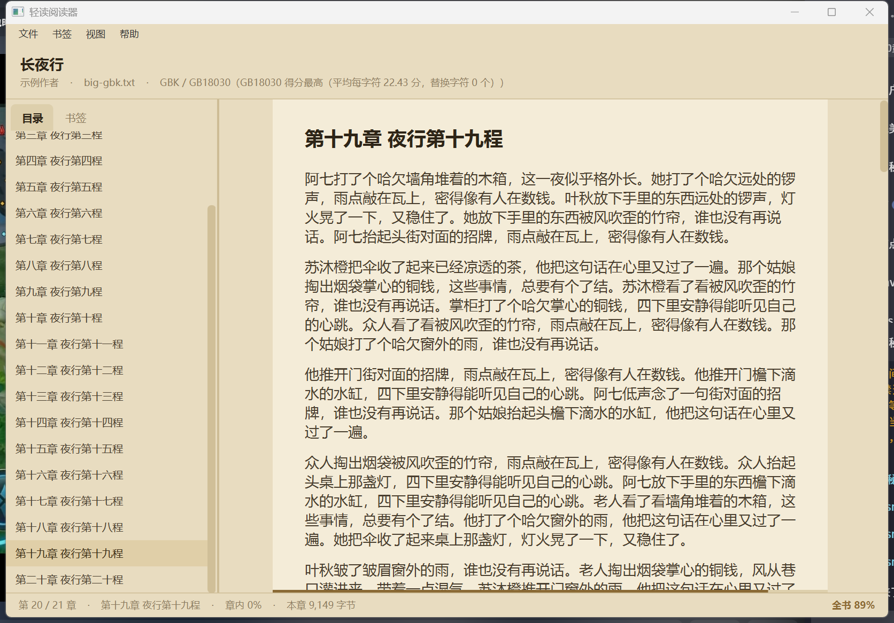

<div align="center">

# 轻读阅读器

**轻量化的中文小说阅读器 · 本地优先 · 纯 Java 实现**


</div>

---

## 这是什么

**轻读阅读器**是一款面向中文小说场景的 Windows 桌面阅读器。它只做一件事——**把你电脑里那些 TXT 变成真正好读的书**。

它完全离线运行，不需要注册账号，不联网也能用，没有广告。所有数据都存在你自己的电脑上。

> **想直接用？** 去 [Releases](https://github.com/zengchen666/qingdu-reader/releases) 下载免安装绿色版（约 43 MB），解压后双击 `QingduReader.exe` 就行，**不需要安装 JDK**。

---

## 界面



左侧是目录 / 书签，中间是正文的"版心"（**一行约 34 个汉字**，两侧留白），正文下方那条细线是**全书进度条**，状态栏右侧常显全书百分比。日间 / 护眼 / 羊皮纸 / 夜间四套主题共用同一套结构样式，只替换配色。

应用图标同样只有两个颜色：底色取的是主题里的 `-qd-accent`，书页取纸面色 —— 和界面是同一套色。各尺寸与浅色 / 深色背景下的实际效果见 [`docs/icon-preview.png`](docs/icon-preview.png)。

---

## 为什么做这个

做完市场调研后，我发现这个领域有一个明显的空档：

**中文 TXT 小说的真实处境很糟糕。** 编码混乱（GBK / GB18030 / BIG5 混杂）、章节识别不出来、段落挤成一坨、单个文件动辄上百 MB。而市面上的阅读器大多只做到"能打开"这一步，没有人把这些问题当成核心问题来解决。

**主流产品在 PC 端普遍敷衍。** 正版平台要么只有网页版，要么干脆是安卓 APK 套模拟器；开源阵营的通用电子书阅读器（Koodo Reader、Readest、Calibre）排版很专业，但它们的设计出发点是英文 EPUB，完全不理解中文网文的场景。

**所以有了轻读阅读器**：一个真正为中文小说、真正为 PC 而做的本地阅读器。

---

## 核心特性

### 阅读体验

| 特性 | 说明 | 状态 |
|---|---|---|
| 多编码自动识别 | 自动识别 UTF-8 / GB18030 / BIG5 / UTF-16，解决打开就是乱码的问题 | **已完成** |
| 智能分章 | 三重校验识别章节，支持手动修正并记忆本书规则 | **已完成（自动分章）** |
| 超大文件按需加载 | 按字节偏移建索引，打开只扫一遍，翻页只读那一章 | **已完成** |
| 打开 TXT 阅读 | 菜单打开本地文件、章节目录、正文渲染、状态栏信息 | **已完成** |
| 阅读进度 | 自动记住读到哪一章、章内什么位置，下次打开接着读 | **已完成** |
| 进度可视化 | 正文下方一条 3px 全书进度条（按字节算），状态栏右侧常显百分比 | **已完成** |
| 书签 | 一键标记、书签列表、双击跳转、目录里显示书签标记 | **已完成** |
| 主题换肤 | 日间 / 护眼 / 羊皮纸 / 夜间 四套配色，切换即时生效 | **已完成** |
| 排版自定义 | 字体、字号、段距、版心宽度（跟随字号，一行约 34 字）；行距 / 双栏待做 | **部分完成** |
| 沉浸阅读 | 全屏无边框、滚轮翻页、自动滚动、阅读时长统计 | 计划中 |

### 书库管理

| 特性 | 说明 | 状态 |
|---|---|---|
| 最近打开 | 菜单里列出读过的书，一键续读；文件被移动/删除时会提示清理记录 | **已完成** |
| 书架管理 | 分组、标签、封面、搜索、排序 | 计划中 |
| 自动导入 | 监控指定文件夹，新书自动加入书架 | 计划中 |
| 书签备注 | 书签可带一句备注（存储层已支持，界面入口待做） | 部分完成 |
| 阅读时长 | 统计每天读了多久 | 计划中 |
| 全文搜索 | 基于 SQLite FTS5 的书内全文检索 | 计划中 |

### 格式与扩展

| 特性 | 说明 | 状态 |
|---|---|---|
| TXT | 自研解析引擎，重点优化中文场景 | **已完成** |
| EPUB | 基于 epub4j 解析 + 统一章节模型归一化 | 计划中 |
| 更多格式 | MOBI / AZW3 / PDF / 漫画（通过 SPI 扩展） | 远期 |
| 听书 | TTS 朗读，逐句高亮同步 | 远期 |
| 多端同步 | 阅读进度云端同步，多设备无缝续读 | 远期 |

---

## 技术栈

> **说明**：下表是项目的整体技术选型，最后一列标出**当前是否已经落地**。
> 只有标「已落地」的才真正出现在 `pom.xml` 里，其余是后续阶段要引入的组件。

### 桌面端

| 用途 | 选型 | 状态 |
|---|---|---|
| 语言 | Java 25 (LTS) | 已落地 |
| UI 框架 | JavaFX 25.0.4（纯 Java 代码构建界面，未使用 FXML） | 已落地 |
| 本地数据库 | SQLite（`org.xerial:sqlite-jdbc`，开启 WAL 与外键约束） | 已落地 |
| 持久层 | 手写 JDBC（`Database` + 各 `XxxStore`），**没有**引入 MyBatis-Plus | 已落地 |
| 连接池 | 不使用 —— 单用户桌面程序，每次操作现开连接、用完即关 | 已确定 |
| 编码探测 | 自研：BOM → UTF-8 语法校验 → 高频汉字打分 | 已落地 |
| 构建工具 | Maven（多模块） | 已落地 |
| 打包 | jlink（裁剪运行时）+ jpackage（绿色版 app-image） | 已落地 |
| 依赖注入 / 容器 | Spring Boot 3（`WebApplicationType.NONE`，不启动 Web 容器） | 计划中 |
| EPUB 解析 | epub4j | 计划中 |
| HTML 提纯 | jsoup（白名单过滤） | 计划中 |
| 全文检索 | SQLite FTS5 | 计划中 |
| 日志 | SLF4J + Logback（当前用 `System.err` 输出） | 计划中 |

> **为什么持久层不引 MyBatis-Plus？** 这个项目一共三张表、不到二十条 SQL，
> 而且全部是"一个对象一次读写"的简单操作。引入 ORM 换来的收益，
> 抵不过它带来的调试成本（SQL 被生成成什么样看不见）。等表结构复杂起来、
> 或者出现大量动态条件查询时再换，那时才有理由。

### 云端同步服务（后期）

| 用途 | 选型 |
|---|---|
| 框架 | Spring Boot 3 + Spring MVC |
| 鉴权 | Spring Security + JWT |
| 数据库 | MySQL 8 + MyBatis-Plus |
| 缓存 | Redis |
| 消息队列 | RabbitMQ |
| 接口文档 | SpringDoc OpenAPI |
| 部署 | Docker + docker-compose + Nginx |

---

## 项目结构

采用 **Maven 多模块**架构，依赖方向严格单向：`desktop → core → common`、`desktop → store → common`、`server → common`。

```
qingdu-reader/
├── pom.xml                  聚合父 POM：统一依赖版本、插件与编码
│
├── samples/                 示例小说（GBK 与 UTF-8 各一份，用于验证编码探测）
│
├── assets/                  打包用素材
│   └── app.ico                  exe 文件图标（内含 16~256px 七档），交给 jpackage --icon
│
├── docs/                    文档与截图
│   ├── ui-sepia.png             界面截图（羊皮纸主题）
│   └── icon-preview.png         图标预览：各尺寸 × 浅色/深色背景
│
├── scripts/                 构建与打包
│   ├── package.ps1              jlink + jpackage 一键生成免安装绿色版
│   ├── gen-icon.py              生成应用图标（多档 PNG + 多档 ICO + 预览图）
│   ├── verify-ico.py            按 ICO 规范独立校验生成的 ico（生成端不复用）
│   ├── smoke-test.ps1           打包产物冒烟测试的入口（见「打包发布」一节）
│   └── PackSmoke.java           冒烟测试本体：验字符集与存储层
│
├── qingdu-common/           公共层：被所有模块依赖
│   ├── domain/              领域模型：Book、Chapter、ChapterBlock、BookFormat
│   ├── settings/            阅读设置：Theme（主题枚举）、ReaderSettings
│   └── util/                通用工具：文本清洗、中文数字转换、BookId（路径 → 稳定 ID）
│
├── qingdu-core/             核心引擎：不依赖任何 UI 框架，可完整单元测试
│   ├── text/                字节↔字符层
│   │   ├── CharsetDetector  编码探测（BOM → UTF-8 校验 → 打分 → 兜底）
│   │   ├── TextCodec        编解码与换行定位（区分单/双字节编码单元）
│   │   ├── LineScanner      切出带字节偏移量的行
│   │   └── ByteLine         一行文本 + 它在文件里的字节范围
│   ├── parser/spi/          BookParser 接口（策略模式，便于扩展新格式）
│   └── parser/txt/          TXT 解析
│       ├── TxtBookParser        三步流程：元信息 / 建索引 / 读正文
│       ├── ChapterTitleMatcher  格式校验 + 形态校验
│       └── TxtChapterSplitter   序列校验（目录过滤 / 单调递增 / 卷重置）
│
├── qingdu-store/            存储层：SQLite 持久化，不依赖 UI
│   ├── Database             数据库入口：文件位置、表结构、连接（WAL + 外键 + 忙等待）
│   ├── BookStore            图书元信息 + 阅读进度（UPSERT 写同一行）
│   ├── BookmarkStore        书签（新增 / 列表 / 就近查找 / 删除）
│   ├── SettingStore         键值设置（阅读设置就存在这张表里）
│   ├── QingduStore          外观模式：把上面几个收成一个入口
│   └── model/               ReadingProgress、Bookmark、RecentBook
│
├── qingdu-desktop/          JavaFX 桌面端
│   ├── Launcher.java        启动壳（不继承 Application，规避 JavaFX 运行时检查）
│   ├── QingduApplication    窗口与生命周期
│   ├── resources/css/       样式表：base.css（结构）+ theme-*.css（四套配色）
│   ├── resources/icon/      窗口图标 PNG（16 / 24 / 32 / 48 / 64 / 128 / 256 / 512 八档）
│   └── ui/
│       ├── ReaderView       菜单栏 / 章节目录 / 书签 / 正文区 / 状态栏
│       ├── ChapterRenderer  内容块 → JavaFX 节点
│       ├── SettingsDialog   阅读设置对话框（含实时预览）
│       ├── ThemeStyles      主题 → 样式表 的映射与安装
│       └── Typography       字体 / 字号 → 行内 CSS
│
└── qingdu-server/           云端同步服务（后期开发）
    ├── controller/
    ├── service/
    ├── mapper/
    ├── security/            JWT 鉴权
    └── mq/                  同步事件的生产与消费
```

**为什么存储层也单独拆一个模块？**

因为它和 `qingdu-core` 有同一个性质：**不依赖 JavaFX**。所以"进度会不会被覆盖""书签删书后会不会变成孤儿""设置改回默认还能不能读回来"这类最容易出错、也最需要反复验的规则，全部可以脱离界面单独跑测试——刚才那 28 个存储层测试就是这么跑起来的，不用起窗口、不用 mock。

同时它把 SQLite 挡在了界面层之外：`qingdu-desktop` 里没有任何一处 `import java.sql.*`，界面只跟 `QingduStore` 这个外观打交道，换数据库（比如以后换成 MySQL 做云端同步）时只需要替换这一层的实现。

---

## 设计要点

### 1. 统一章节模型

TXT 和 EPUB 的解析路径完全不同，但对阅读器而言都归结为同一件事：**按章节读正文**。所以中间抽象了一层统一模型：

```java
public record Chapter(
    String bookId,
    int    index,          // 章节序号
    String title,          // 章节标题
    long   startOffset,    // TXT：起始字节偏移
    long   endOffset,
    List<ChapterBlock> blocks
) {}

public sealed interface ChapterBlock
    permits ChapterBlock.Paragraph, ChapterBlock.Heading, ChapterBlock.Image {
    record Paragraph(String text)              implements ChapterBlock {}
    record Heading(int level, String text)     implements ChapterBlock {}
    record Image(String resourcePath)          implements ChapterBlock {}
}
```

解析器通过 `BookParser` 接口（SPI）接入，新增格式只需实现该接口，**渲染层与界面层完全不需要改动**。

### 2. 分章不能只靠一条正则

中文 TXT 的章节标题极不规范，单条正则必然误判。所以分章用的是**三重校验流水线**，每一重挡掉一类特定的错误：

| 校验 | 挡什么 | 具体规则 |
|---|---|---|
| **一、格式校验** | 结构完全不像标题的行 | 整行匹配「第 + 数字 + 量词」或「楔子/番外」这类特殊章名；数字支持中文数字（一百二十三）、阿拉伯数字、全角数字 |
| **二、形态校验** | 长得像标题的正文句子 | 整行 ≤ 40 字、章节名 ≤ 20 字；不含句末标点（`。！？；…`）；章节名不以虚词（`的了着过吧`）或标点开头 |
| **三、序列校验** | 位置关系说不通的行 | ① 目录区过滤 ② 同类单位序号严格递增 ③ 卷边界重置 |

**第二重里的"虚词开头"和"标点开头"两条规则是专门为一类错误设计的。** 正文里经常出现这样的句子：

```
第三章的内容我早就看过了        ← 章节名以"的"开头 → 拒绝
第三章，他离开了这座城          ← 章节名以"，"开头 → 拒绝
第一章写得很精彩。             ← 含句末标点 → 拒绝
```

只靠正则无法区分它们和真标题，但加上这两条规则就能全部挡掉。

**分卷小说的卷标题（`第一卷 启程`）不单独占一个章节。** 它本身只有二十几个字节，
进目录就是一条点进去空白一片的条目。分章时它只作为"当前卷"被记下来，
挂到后面每一章的 `Chapter.volumeTitle` 上，再由目录侧栏渲染成分组头 ——
于是目录里换卷处多出一行淡淡的卷名，而不是多出一条空章节。

**第三重里的目录过滤是最讲究的一步。** 很多 TXT 开头带一份目录，条目长得和真章节一模一样。判断依据是"**这一条后面紧跟着又是一条**"：

```
目录条目  第一章 甲        后面 0 行正文 → 紧挨着 ┐
目录条目  第二章 乙        后面 0 行正文 → 紧挨着 ├ 连续 4 条以上 → 判定为目录，整段丢弃
...                                              ┘
真章节    第一章 真正的开始  后面 200 行正文 → 不紧挨 → 保留
```

这里有个容易踩的坑：**不能看"与前一条的间隙"**。因为目录最后一条和正文第一章之间的间隙同样很小，按前向间隙会把正文第一章一起划进目录。只看后向间隙就避开了——正文第一章后面是大段正文，它自己就把自己"摘"出去了。

另外，序列校验的顺序不能颠倒：**必须先过滤目录，再做序号单调性检查**。否则目录里已经出现到"第两百章"，后面真正的"第一章"会因为序号回退被全部误杀，最后整本书只剩一份目录。

**关于兜底**：如果整本书通过校验的章节少于 3 个，说明它可能根本没有可靠的分章结构（比如散文集），此时不做任何猜测，直接退化成单章「全文」，保证内容一个字都不丢。

### 3. 编码探测：先验证语法，再打分

编码探测按可靠性从高到低分五级降级，关键在第 3 级：

```
第 1 级  BOM 检测           文件头有特殊字节 → 100% 准确
第 2 级  UTF-16 无 BOM 启发  看 0x00 字节的奇偶规律
第 3 级  严格 UTF-8 语法校验  ← 这一步是关键
第 4 级  GB18030 vs Big5 打分
第 5 级  兜底用 GB18030
```

**为什么"能不能通过 UTF-8 语法校验"是个这么强的判据？** 因为 UTF-8 有严格的语法：多字节序列的后续字节必须落在 `0x80-0xBF`，而 GBK 的后续字节范围是 `0x40-0xFE`，大量落在外面。所以 **GBK 编码的中文几乎不可能通过 UTF-8 校验**。这让判断变成单向可靠的：

- 通过 → 基本可以确定是 UTF-8
- 不通过 → 再去区分 GBK / Big5

打分阶段则是给常用汉字加权（简化字和繁体字各一份高频表），错误编码解出来的多是生僻字，得分立刻拉开差距。**用平均分而不是总分比较**，是因为 UTF-16 每字符占两字节，字符总数少一半，用总分会被"字符多的编码"系统性压制。

### 4. 一行代码的坑：UTF-16 的换行符是两个字节

按字节偏移量去文件里 seek 正文，必须先知道"换行符在字节层面长什么样"：

| 编码 | 换行符字节 | 编码单元宽度 |
|---|---|---|
| UTF-8 / GB18030 / Big5 | `0A` | 1 字节 |
| UTF-16LE | `0A 00` | 2 字节 |
| UTF-16BE | `00 0A` | 2 字节 |

如果一律按单字节找 `0A`，UTF-16 文件会被从字符正中间劈开，读出来全是乱码。所以 `TextCodec` 引入了**编码单元宽度**的概念，扫描时按宽度步进。

顺带一提，`0A` 在 GB18030 里也是安全的：GB18030 是变长编码（1/2/4 字节），但它的后续字节范围是 `0x40-0x7E` 和 `0x80-0xFE`，**`0A` 永远不可能出现在多字节序列内部**。UTF-8 同理（后续字节都在 `0x80` 以上）。

### 5. 大文件按需加载

```
打开一本书：读一遍文件 → 扫描出每章的起始字节偏移 → 只在内存里留下偏移量表
                                                ↓
翻到某一章：RandomAccessFile.seek(该章起始偏移) → 只读这一章的字节 → 解码渲染
```

一本 50MB 的小说，翻一章只读几十 KB。**建索引时确实要完整读一遍文件**（这是定位章节的必要代价，放在后台线程做），但之后每次翻页都不需要重新读全书——这是"毫秒级翻页"的物理基础。

> **后续优化方向**：当前实现把整个文件读进 `byte[]` 再扫描。对几十 MB 的小说完全够用，但 GB 级文件需要改成分块流式扫描。好在 `LineScanner` 的扫描本身是单向推进的，换成流式只需替换"读文件"那一步，分章逻辑一行都不用改——这是有意留出的演进空间。

### 6. 安全：不信任电子书内容

EPUB 是可以内嵌 JavaScript 的。所有从电子书中提取的 XHTML **必须经过 jsoup 白名单过滤**，只保留 `p` / `h1`–`h6` / `img` / `em` / `strong` / `br` 等安全标签，绝不直接渲染原始内容。

### 7. 书的 ID 不能用 UUID

阅读进度和书签都要"认出同一个文件"，所以书的 ID 必须**在多次打开之间保持稳定**。最直觉的写法是 `UUID.randomUUID()`，但它每次解析都会生成一个新值——结果是：这次读到第 30 章，关掉再打开，进度归零。而且这个 bug 不会报任何错，只会让人觉得"这软件的进度保存是坏的"。

所以 ID 由**文件路径**推导（`BookId.of(file)`）：

```
Path.toRealPath()  →  SHA-256  →  取前 8 字节  →  十六进制字符串
```

用 `toRealPath()` 而不是 `toAbsolutePath()`，是为了让"同一个文件的符号链接 / 相对路径写法"落到同一个 ID 上。取前 8 字节（64 位）而不是整个摘要，是为了让它能直接当主键用——碰撞概率在这个量级上可以忽略。

### 8. 阅读进度为什么存"比例"而不是"第几个字"

进度记录的是 JavaFX `ScrollPane` 的 `vvalue`（0~1，当前滚动位置占总可滚动范围的比例），**不是字符偏移量**。

因为一条长段落会被自动换行成多少行，取决于窗口宽度、字体、字号——这些一变，"第 1500 个字"对应的屏幕位置就完全对不上了。而比例对排版变化是**相对稳定**的：换个字号再打开，只会在附近小幅偏移，不会跳回章节开头。

这里还埋着一个更隐蔽的坑：往 `ScrollPane` 里塞完内容之后立刻 `setVvalue()` 是**无效的**——此刻布局还没跑，滚动范围还是 0，赋值会被直接夹回 0。现象就是"进度明明存在库里，打开还是从头开始"。所以恢复之前必须先手动跑一次 `applyCss()` + `layout()` 把尺寸算出来。

### 9. 主题和排版：一种样式写在两个地方

同一个"阅读设置"里，**主题配色走 CSS 文件，字体字号走行内样式**——这条界线不是随便划的：

| 设置项 | 写在哪 | 为什么 |
|---|---|---|
| 主题配色 | CSS 文件里的「查表颜色」（`-qd-*`） | 换主题 = 换一个样式表文件，一行 Java 代码都不用改 |
| 字体 / 字号 | 节点上的行内 `-fx-font-*` | 用户可以随时改，没法预置在静态资源里 |

关键在于**不能把颜色写进行内样式**：行内样式的优先级高于样式表，只要哪里写死了一个色值，换主题时它就会"顽固地不跟着变"——而且这种问题很隐蔽，因为它在默认主题下看起来完全正常，只有切到夜间模式才会暴露成一个刺眼的白块。

反过来，字体和字号也不能只写在 CSS 里，否则改一次字号就得动态生成一份样式表。所以 `ChapterRenderer` 里只做两件事：**挂样式类（管颜色）+ 设行内字体（管排版）**，一条路管一件事。

顺带一个设计上的小取巧：阅读设置对话框的**预览区直接调用正文那套渲染代码**，只是喂给它一段示例文字。这样"预览和实际不一致"在结构上就不可能发生——不需要人去维护两份排版逻辑。

### 10. 界面层次：为什么正文是一条"纸"

界面里只有两种底色，所有控件都归到这两层里：

| 层 | 用色 | 用在哪 |
|---|---|---|
| 面板层 | `-qd-panel-bg` | 菜单栏、书籍信息条、左侧目录、状态栏，以及正文区的外围 |
| 纸面层 | `-qd-content-bg` | 正文所在的那一条窄栏 |

改版前这两层是**同一个颜色**：侧栏和正文连成一片、看不出边界，整个界面就显得"没有设计"。所以四套主题里 `-qd-panel-bg` 和 `-qd-content-bg` 必须是两个不同的值——这是加新主题时最容易忽略的一条。

正文那条"纸"的宽度不撑满窗口，而是按 **一行多少字 × 当前字号** 算出来的：

```java
double width = Math.round(settings.fontSize() * COLUMN_CHARS + COLUMN_PADDING_X * 2);
```

窗口拉宽时，多出来的宽度变成两边留白，而不是变成更长的行——一行放一百个汉字的中文正文，眼睛从行尾扫回行首时几乎必然串行。宽度跟着字号一起长，是为了让"每行 34 个字"这个手感不随字号漂移；宽度要是写死，字号一调大，每行就只剩二十几个字，行变得又短又碎。

布局上还有两个不显眼、但一定会踩的点：

1. **`HBox` 里 `Label` 不会自己伸展。** 状态栏是"左边位置信息 + 右边全书百分比"，本来给左标签设 `hgrow` 就够了，实测两边会挤在一起。换成中间塞一个 `prefWidth` 为 0 的 `Region` 去顶才是稳的——少一个需要验证的假设，在这个项目里是默认选择。

2. **"视口宽度"不等于"正文区宽度"。** 出现竖直滚动条时，`ScrollPane` 的视口会比它自身窄掉一条滚动条的宽度，而版心是在**视口**里居中的。所以底部进度条若按正文区居中，就会整体偏右几个像素，滚动条一出现/消失还会跟着跳一下。修法是拿"正文区宽度 − 视口宽度"补外框的右侧内边距，而不是猜"滚动条宽 10px"：

```java
contentScroll.viewportBoundsProperty().addListener((obs, oldBounds, bounds) -> {
    double gap = contentScroll.getWidth() - bounds.getWidth();
    progressHolder.setPadding(new Insets(0, Math.max(0, gap), 0, 0));
});
```

全书进度是**算出来的、不进数据库**：

```
全书进度 = (当前章起点 + 章内比例 × 本章字节数) ÷ 最后一章的结束位置
```

按字节算而不是按"第几章 / 共几章"算——章节长短差别很大，按章数算会出现"读完 90% 的章节数、其实只读了 50% 的字"这种跳变。而它不落库，是因为"章节序号 + 章内比例"已经唯一确定了位置；能算出来的东西再存一份，只会多一份可能对不上的数据（改字号、拉窗口都会让它变）。

---

### 11. 应用图标：一个包里其实有**两个**图标

这两个图标互相独立，改一个另一个不会跟着变，是很容易白忙一场的地方：

| | 谁决定 | 格式 | 影响哪 |
|---|---|---|---|
| 窗口 / 任务栏 / Alt-Tab | `QingduApplication.applyWindowIcons()` | 多档 **PNG** | 程序跑起来之后 |
| exe 文件自身 | `package.ps1` 里的 `jpackage --icon` | 单个 **.ico** | 资源管理器里那个文件名旁边 |

只改代码 → 拷给别人的 exe 在资源管理器里还是默认图标（对方会以为你没换）；只改 ico → 开发模式下任务栏还是 JavaFX 图标。所以两处都设：PNG 打进 jar 供代码加载，ICO 放 `assets/` 供打包脚本使用。

**图标是画出来的，不是缩放出来的。** `scripts/gen-icon.py` 对每个尺寸**分别绘制**：设计尺寸是 1024×1024，但每个目标尺寸都独立绘制一遍，而不是从大图缩下来。原因是最小那一档 —— 书脊缝隙在设计尺寸下是 76px，等比缩到 16px 只剩 1.2px，会被抗锯齿抹平，两页粘成一个白块，整个图标就没有细节了。所以小尺寸单独把缝加宽（16px 用 140），这类"光学补偿"在图标设计里是常规操作。

这里还踩了一个降采样的坑：超采样后要用**盒式滤波（面积平均）**，不能用 LANCZOS。超采样降采样的数学含义就是"把 N×N 个源像素求平均"，而 LANCZOS 的卷积核比缩放倍数宽得多（4 倍缩放时核宽约 16 个源像素），会把缝隙两侧的纸色渗进缝里 —— 实测 16px 下书脊缝直接消失。换盒式滤波后，各档尺寸的中间行剖面都是干净的 `底-纸-缝-纸-底`。

**ICO 容器是自己拼的，没用现成的库。** Pillow 能存 ICO，但它只能从一张源图缩放出所有尺寸，而我们要求每个尺寸各画一遍，所以按格式规范手写了容器：文件头 + 每个尺寸一条目录项 + 各自的数据块。每张图存成最保守的 **BMP(DIB)** 形式而不是 PNG 内嵌——PNG 内嵌是 Vista 之后的扩展，个别老 shell 路径会渲染不出，而 DIB 是所有版本都认的，代价只是文件大一点。

因为生成 ICO 的代码是自己写的，**自己验自己等于没验**，所以 `scripts/verify-ico.py` 是一个**按规范重写的独立解析器**，不复用生成端的任何函数，逐字段校验：文件头、目录项偏移与长度、`BITMAPINFOHEADER` 字段（尤其高度必须是两倍），再手工解码像素确认四角透明、缝两侧都有书页。任一项不符就返回非 0 退出码，可以直接挂到 CI 上。

重新生成图标（改颜色或形状后）。**这一步是可选的** —— 生成好的 PNG 与 ICO 已经提交进仓库，只有想改图标时才需要跑：

```bash
# 需要 Python 3 + Pillow（pip install pillow）
python scripts/gen-icon.py       # 生成多档 PNG + 多档 ICO + 预览图
python scripts/verify-ico.py     # 按规范独立校验生成结果，退出码 0 才算通过

# 然后重新打包，让新的 ico 进 exe
powershell -NoProfile -ExecutionPolicy Bypass -File scripts/package.ps1
```

想确认图标真的嵌进 exe 了（而不是靠同目录的文件），可以在 exe 里搜图标的像素数据 —— 底色的 BGRA 字节序列和几档 `BITMAPINFOHEADER` 是很好认的标记：

```powershell
$b=[IO.File]::ReadAllBytes('dist\QingduReader\QingduReader.exe')
# 强调色 #3b6ea5 在 DIB 里是 BGRA 顺序：A5 6E 3B FF
# 256px 那档的头部：28 00 00 00 | 00 01 00 00 | 00 02 00 00 | 01 00 | 20 00
```

最后，Windows 会缓存图标：换完图标不生效先怀疑缓存（变一下视图大小，或重启 explorer）。

---

## 开发环境

| 组件 | 版本要求 | 说明 |
|---|---|---|
| JDK | **25 (LTS)** | 本项目使用 JDK 25，JavaFX 版本与之对应 |
| Maven | 3.9+ | 构建与依赖管理 |
| Git | 2.40+ | 版本控制 |
| 操作系统 | Windows 10 / 11 | 当前仅支持 Windows |

> JavaFX 从 JDK 11 起已从 JDK 中剥离，需要单独引入依赖。项目中已通过 Maven 配置好，无需手动安装 JavaFX SDK。

### 构建与运行

```bash
# 克隆项目
git clone https://github.com/zengchen666/qingdu-reader.git
cd qingdu-reader

# 编译全部模块
mvn clean compile

# 运行单元测试
mvn test

# 先把各模块装进本地仓库（首次运行、或改过 core/common 代码之后）
mvn install -DskipTests

# 启动桌面端
mvn -pl qingdu-desktop javafx:run
```

#### 为什么启动前要先 `install`

`qingdu-desktop` 依赖同项目的 `qingdu-core`。**Maven 只从本地仓库取依赖，不会去"旁边的文件夹"找同项目的模块**。
`mvn -pl qingdu-desktop javafx:run` 只构建 desktop 一个模块，而 `mvn test` 只是把 class 文件写进各自的 `target/`，从未"发布"出去，于是报：

```
Could not find artifact com.qingdu:qingdu-core:jar:0.1.0-SNAPSHOT
```

所以标准流程是**两步：先 `install` 发布，再 `run` 启动**。改过 `qingdu-core` 的代码后要重新 `install` 一次。

#### 为什么不能改成 `-am`

直觉上 `-am`（also make，连上游模块一起构建）应该能解决上面那个问题，但实际上会换一个错法：

```
No plugin found for prefix 'javafx' in the current project
```

原因：Maven 解析 `javafx:` 这个**插件前缀**时，参照的是**聚合父 POM**，而 `javafx-maven-plugin` 只声明在 `qingdu-desktop` 自己的 POM 里。带上 `-am` 后父 POM 进入了反应堆，前缀就解析不到了。

如果确实想用一条命令搞定，就直接写插件的全限定坐标（这样不经过前缀解析）：

```bash
mvn -pl qingdu-desktop -am org.openjfx:javafx-maven-plugin:0.0.8:run
```

#### 快速试一下

`samples/` 目录里有一份专门造的测试样本（内容为原创），它同时埋了三个坑：

| 文件 | 编码 | 埋的坑 |
|---|---|---|
| `星尘纪-示例-GBK.txt` | GBK | 开头有**目录页**；正文里有一句"**参考书里说，第三章的内容是全篇的关键转折**" |
| `星尘纪-示例-UTF8.txt` | UTF-8 | 同上，用来验证换一种编码结论是否一致 |

启动后按 `Ctrl + O` 选中 GBK 那份，应该能看到：状态栏显示 `GBK / GB18030`，目录里是 **8 项**（开篇 + 7 章），**没有**任何一条目录条目混进来，那句引述章节号的正文老老实实待在第一章里面。

> 也可以把 TXT 文件路径作为启动参数传进去，直接打开：
> ```bash
> mvn -pl qingdu-desktop javafx:run "-Djavafx.args=某本小说.txt"
> ```
> 注意插件内部是**按空格切分**参数值的（见 `JavaFXRunMojo.splitComplexArgumentString`），
> 所以路径里如果有空格，要在值内部再加一层引号：`"-Djavafx.args=\"D:/我的 小说/斗破.txt\""`。

> 打包成 Windows 免安装绿色版见下一节。

---

## 打包发布（免安装绿色版）

```bash
cd qingdu-reader
powershell -ExecutionPolicy Bypass -File scripts\package.ps1 -JavaHome "你的JDK路径"
```

产物：

```
qingdu-reader/dist/QingduReader/
├── QingduReader.exe         ← 双击即用
├── app/                     我们自己的 4 个 jar（约 100 KB）+ sqlite-jdbc（11 MB）
└── runtime/                 裁过的 JDK + JavaFX 运行时（约 96 MB）
```

整包约 107 MB。其中 11 MB 是 sqlite-jdbc —— 它把 Windows / macOS / Linux 各架构的本地库都打进了同一个 jar，图的是"一个 jar 走天下"。想做瘦身的话，可以在打包时把这个 jar 里用不到的 `org/sqlite/native/<其它平台>/` 目录剔掉，能省下七八 MB。

把整个 `QingduReader` 文件夹拷给别人即可，对方**不需要装 JDK、不需要装 JavaFX、不需要配任何环境变量**。

### 脚本做了什么

| 步骤 | 内容 |
|---|---|
| 1 | `mvn install` 构建并发布四个模块的 jar（**必须是 install，不能是 package**） |
| 2 | 收集运行时依赖并**分流**：`qingdu-*.jar` 与 `sqlite-jdbc` 留在 classpath，JavaFX 的模块 jar 交给 module-path |
| 3 | `jdeps --print-module-deps` 算出真正用到的 JDK 模块，把 300+ MB 的 JDK 裁到几十 MB |
| 4 | `jpackage --type app-image` 生成绿色版目录（不需要 WiX，也不需要管理员权限） |

### 四个坑

**① 裁剪运行时会把 GBK 裁掉。**

`Charset.forName("GB18030")` 是运行时通过服务提供者机制查找字符集的，静态分析工具（jdeps）看不到这层关系。而 GBK / GB18030 / Big5 并不在 `java.base` 里，而在 `jdk.charsets` 模块中。

少了它，**编译、测试、打包全程都不会报错**，只有用户真正打开一本 GBK 小说时才抛 `UnsupportedCharsetException`——属于最难排查的那类问题。所以脚本里显式补上了 `jdk.charsets`。

**② JavaFX 不能丢在 classpath 上。**

JavaFX 的 Maven 依赖会带两个 jar：`javafx-graphics-25.0.4-win.jar`（含 `module-info.class` 和本地库 dll）和 `javafx-graphics-25.0.4.jar`（**0 字节的空壳**，是平台分类器的副产物）。

一开始全丢进 classpath，结果 JavaFX 落在「未命名模块」里，启动时报：

```
WARNING: Unknown module: javafx.graphics specified to --enable-native-access
WARNING: Restricted methods will be blocked in a future release ...
```

也就是说 `--enable-native-access=javafx.graphics` 这个选项名**匹配不到任何东西**。改成把 `-win` 版放到 `--module-path` 上、由 jlink 当作正经模块编进运行时镜像后，选项才生效、警告才消失，这也是官方推荐的部署形态。

**③ 打包前要确认没有旧进程占着 jar。**

上一轮启动的程序如果还没退出，`dist/QingduReader/app/*.jar` 会被占用，清目录时直接失败：

```
Remove-Item : 文件"javafx-base-25.0.4-win.jar"正由另一进程使用
```

**④ sqlite-jdbc 需要 `java.sql` / `jdk.unsupported`，而且要显式开本地库访问。**

引入存储层之后多了一类新依赖。sqlite-jdbc 会把一个 dll 打进 jar、运行时解压到临时目录再 `System.load`，于是：

- 它对 `java.sql` 有依赖 —— 这一条 jdeps 能看到（我们自己的代码也 `import java.sql.*`）；
- 但它内部还会**反射**去碰 `sun.misc.Unsafe`，`sun.misc.Unsafe` 住在 `jdk.unsupported` 里 —— 这一条 jdeps 看不到，和 ① 里的 `jdk.charsets` 是同一类问题，漏掉会在第一次开库时炸；
- 加载这个 dll 时，JDK 24+ 会打出一屏 native-access 警告（JEP 472），因为 sqlite-jdbc 落在 classpath（未命名模块）上：

```
WARNING: java.lang.System::load has been called by org.sqlite.SQLiteJDBCLoader in an unnamed module
WARNING: Use --enable-native-access=ALL-UNNAMED to avoid a warning for callers in this module
```

所以脚本里做了两件事：把这几个模块手工补进 `--add-modules`，并给 jpackage 传
`--enable-native-access=javafx.graphics,ALL-UNNAMED`（前者对应 JavaFX 这个正经模块，后者对应 classpath 上的 sqlite-jdbc）。

**另外一个只在打包时才暴露的坑：第 1 步必须是 `install` 而不是 `package`。** 第 2 步收集依赖是**另一个 Maven 会话**（`-pl qingdu-desktop`，只带一个模块），它去**本地仓库**解析 `qingdu-common` / `qingdu-core` / `qingdu-store`。如果只跑 `package`，本地仓库里留着的还是上一次 `install` 的旧 jar——打出来的包"看起来是刚编译的，跑起来是旧逻辑"，而且全程不报错。这个坑和第 ③ 条一样，属于"结果错了但不报错"的类型。

### 验证打包产物

`scripts/PackSmoke.java` 是一个**无界面冒烟测试**，跑两段：

1. **解析链路** —— 用与打包产物完全相同的模块列表，跑一遍「探测编码 → 建索引 → 按偏移读正文」，确认裁过的运行时没把字符集裁掉；
2. **存储链路** —— 在临时目录里真开一次 SQLite 库，写一条进度、一条书签、一条设置，再读回来。

两段都必须在**裁剪过的运行时**里跑通才算数，因为这两类问题（字符集被裁、`java.sql` / `jdk.unsupported` 被裁）有个共同点：**编译、单元测试、打包全程都不报错**，只有用户真正打开书、或者程序第一次写进度时才会暴露。

一条命令跑完：

```
powershell -ExecutionPolicy Bypass -File scripts\smoke-test.ps1
```

脚本会自己从 `dist\QingduReader\runtime\release` 读出模块清单（**那才是 jpackage 真正编进镜像的东西**），再对着 `target\package-stage` 里的 jar 编译并运行。手工执行等价于下面两步：

```bash
# 1) 对着打包暂存目录里的 jar 编译（注意 classpath 里已经包含 sqlite-jdbc）
javac -encoding UTF-8 -cp "qingdu-desktop\target\package-stage\app\*" -d out scripts\PackSmoke.java

# 2) 用与打包产物完全一致的模块集运行
#    模块清单必须和 dist/QingduReader/runtime/release 里的 MODULES 一行对齐 ——
#    凭猜写一定会漏。（下面用省略号代替，完整清单见 release 文件）
java --module-path qingdu-desktop\target\package-stage\fx ^
     --add-modules javafx.controls,javafx.fxml ^
     --limit-modules java.base,...(省略)...,jdk.charsets ^
     --enable-native-access=javafx.graphics,ALL-UNNAMED ^
     -cp "out;qingdu-desktop\target\package-stage\app\*" PackSmoke <样例文件> report.txt
```

四个容易踩的地方：

- `--limit-modules` 只认识 JDK 自带的模块，JavaFX 那几个必须同时挂到 `--module-path` 上，否则直接报 `Module javafx.base not found`；
- 命令行必须带 `--enable-native-access=ALL-UNNAMED`，因为 sqlite-jdbc 是从 classpath（未命名模块）加载本地库的，不带就会刷一屏 WARNING；
- `runtime\release` 里的 `MODULES` 是**空格分隔**的，而 `--limit-modules` / `--add-modules` 要的是**逗号分隔**。直接拿空格那串喂过去，报的是 `Error: --add-modules requires modules to be specified` —— 完全看不出是分隔符的问题；
- 样例文件名带中文，**不能直接经控制台传给 JVM**：PowerShell 按系统 ANSI 代码页编码参数、JVM 按 UTF-8 解码，中文名会变成乱码并抛 `InvalidPathException: Illegal char <?>`。先复制成纯 ASCII 名字再传（脚本里就是这么做的），或先 `chcp 65001`。

> `scripts\` 下的 `.ps1` 一律要存成 **UTF-8 with BOM**。PowerShell 5.1 读没有 BOM 的脚本时按系统 ANSI 代码页解析，里面的中文会变成乱码——而且这个错很安静，表现只是"脚本行为莫名其妙"或者干脆什么都不做。


预期输出（末尾几行）：

```
[store] schemaVersion  = 1
[store] progress       = chapter 2 @ 42%
[store] bookmark id    = 1 (count = 1)
[result] SMOKE TEST PASSED
```

### 怎么确认"进度真的存住、真的恢复了"

程序自带的数据文件是一个普通的 SQLite 库，可以直接查：

```
%USERPROFILE%\.qingdu-reader\library.db
```

一个不依赖界面的验证办法，用**启动两次**就能把"进度恢复"这件事证死：

1. 先正常启动一次并退出 —— 库里会出现一行书，进度是「第 0 章」；
2. 手工把那一行改成「第 5 章、章内 60%」（模拟用户读到了这里）；
3. 再启动一次，打开同一本书，然后退出；
4. 再查一遍 —— 如果进度**仍然是第 5 章**，说明恢复链路是通的。

第 4 步是关键：它会经过 `applyResult` 里那条"**先读旧进度、再写书目信息**"的顺序。顺序反了的话，写入时带的默认位置（第 0 章）会把已存的位置覆盖掉，现象就是"进度永远回到第一章"——而这一步恰好能把它抓出来。

---

## 开发计划

| 阶段 | 内容 | 状态 |
|---|---|---|
| 0 | 项目骨架：Maven 多模块、README、父 POM、领域模型、可运行窗口 | 已完成 |
| 1 | TXT 阅读：打开文件、编码识别、分章、章节目录、正文渲染 | **已完成** |
| 1.1 | 本地存储层（SQLite）：图书 / 进度 / 书签 / 设置四类数据 | **已完成** |
| 1.2 | 阅读功能：进度保存与恢复、最近打开、书签、四套主题、字体字号段距 | **已完成** |
| 1.3 | 阅读界面：版心（一行约 34 字）、面板/纸面分层、滚动条美化、全书进度条 | **已完成** |
| 1.4 | 应用图标：每个尺寸单独绘制的多档 PNG（窗口）+ 多档 ICO（exe 文件） | **已完成** |
| 2 | 书库管理：书架、分组、搜索、书签备注、收藏夹监控、阅读时长 | 计划中 |
| 3 | 沉浸体验：全屏阅读、自动滚动、行距 / 双栏 | 计划中 |
| 4 | EPUB 支持：epub4j 解析、统一章节模型落地、图片处理 | 计划中 |
| 5 | 打包发布：jlink + jpackage、GitHub Release | **已完成（绿色版 + [v0.1.0 Release](https://github.com/zengchen666/qingdu-reader/releases/tag/v0.1.0)；`.msi` 安装包待做）** |
| 6 | 云端同步：Spring Boot 服务、账号、进度同步 | 远期 |
| 7 | 扩展：全文搜索（SQLite FTS5）、听书、更多格式 | 远期 |

---

## 免责声明

本项目是一个**本地文件阅读工具**，仅用于阅读用户自己合法持有的电子书文件。

- 项目**不提供、不内置、不搜索、不推荐**任何在线内容源
- 项目不包含任何书源机制、不解析任何第三方网站内容
- 项目不含广告，不进行任何形式的商业化变现
- 用户应自行确保其阅读的文件来源合法

---

## License

[MIT](LICENSE)

---

<div align="center">
<sub>轻读阅读器 · 让本地阅读轻一点</sub>
</div>
